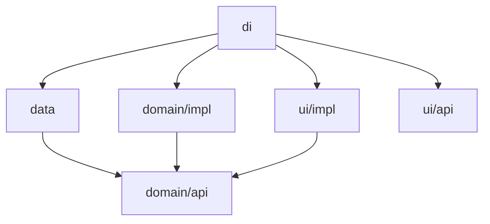

# Template Feature

Yeni feature'ların üretildiği 6 modüllü şablon. İki işi var:

1. **Kaynak** — `./gradlew createLayer` bu modülleri kopyalayıp yeniden adlandırır.
2. **Referans** — MVI ayrımı, Koin kablolaması, nav3 route sahipliği ve polimorfik
   serialization sözleşmesinin tek doğru örneği burada durur.

`settings.gradle.kts`'de include edilmiş, yani `./gradlew build` ile birlikte derlenir —
sözleşme bozulursa build kırılır. Şablonun çürümemesinin tek nedeni bu.

## Modül anatomisi

| Modül | Gradle plugin | İçerik | Bağımlılığı |
|---|---|---|---|
| `domain/api` | `marketsJvmLibrary` | Model + `Repository`/`UseCase` arayüzleri | — (yaprak) |
| `domain/impl` | `marketsJvmLibrary` | `UseCaseImpl` | `domain/api` |
| `data` | `marketsAndroidLibrary` | Ktor `RemoteApi`, DTO, mapper, `RepositoryImpl` | `domain/api`, `network/api` |
| `ui/api` | `marketsAndroidLibrary` | `Route` (`@Serializable`, `NavKey`) | `navigation/api` |
| `ui/impl` | `marketsAndroidFeatureUi` | `Screen`/`State`/`Event`/`ViewModel`/`Wrapper` + `section/` | `domain/api`, `ui/api` (shared) |
| `di` | `marketsAndroidFeatureUi` + `marketsKoin` | Koin modülü — hepsini birbirine bağlar | tümü |



İki kural bu grafikte saklı:

- `domain/api` saf JVM ve hiçbir şeye bakmaz — iş kuralına Android ve Ktor bulaşmaz.
- `ui/impl`, `ui/api`'ye bağımlı **değildir**. Route ile ekranı `di` birleştirir
  (`scope.entry<Route> { Wrapper() }`). Başka feature'lar bu route'a navigasyon yapmak için
  `ui/impl`'i sürüklemek zorunda kalmaz.

## Yeni feature üretmek

Task **katman katman** çalışır; feature'ın tamamını tek komutta üretmez.

```bash
./gradlew createLayer --layer=domain:api  --feature=:markets-features:coins-list
./gradlew createLayer --layer=domain:impl --feature=:markets-features:coins-list
./gradlew createLayer --layer=data        --feature=:markets-features:coins-list
./gradlew createLayer --layer=ui:api      --feature=:markets-features:coins-list
./gradlew createLayer --layer=ui:impl     --feature=:markets-features:coins-list
./gradlew createLayer --layer=di          --feature=:markets-features:coins-list
```

Her komut şunu yapar: kaynak katmanı kopyalar (`build/`, `.gradle/`, `.git/`, `docs/` hariç),
dosya içeriği ve dosya adlarındaki token'ları çevirir, paket dizinlerini taşır,
`settings.gradle.kts`'ye `include(...)` ekler, feature'ın `di/build.gradle.kts`'ine bağımlılık
satırını ekler.

**`di`'yi en sona bırak.** Şablondan gelen `di/build.gradle.kts` zaten tüm katmanları `api(...)`
ile referanslıyor. `di`'yi önce üretirsen sonraki her katman aynı bağımlılığı bir de
`implementation(...)` olarak ekler — task iki satırı aynı saymadığı için mükerrer kayıt oluşur.

### Seçenekler

| Seçenek | Varsayılan | Ne işe yarar |
|---|---|---|
| `--layer` | (zorunlu) | `data`, `domain:api`, `domain:impl`, `ui:api`, `ui:impl`, `di` |
| `--feature` | (zorunlu) | Hedef konum, örn. `:markets-features:coins-list` |
| `--source` | `:template-feature` | Kopyalanacak kaynak feature |
| `--source-layer` | `--layer` ile aynı | Kaynak katman |
| `--base-package` | `gradle.properties` → `projectBasePackage` | Paket kökü |

`--source` ile şablon yerine **gerçek bir kardeş feature**'dan klonlayabilirsin. Şablon fazla
genel kalıyorsa, yakın bir feature'ı kaynak almak geriye daha az düzeltme bırakır:

```bash
./gradlew createLayer --layer=ui:impl --feature=:markets-features:coin-detail \
                      --source=:markets-features:coins-list
```

### Token dönüşümü

`--feature=:markets-features:coins-list` için:

| Kaynak | Hedef | Nerede geçer |
|---|---|---|
| `TemplateFeature` | `CoinsList` | Sınıf/fonksiyon adları, dosya adları |
| `templateFeature` | `coinsList` | Değişkenler, `projects.` erişimcileri |
| `template_feature` | `coins_list` | Paket adı, `namespace` |
| `template-feature` | `coins-list` | Gradle yol parçaları |
| `com.devkurt.markets.template_feature` | `com.devkurt.markets.markets_features.coins_list` | Paket kökü |

## Şablonun taşıdığı sözleşmeler

Şablona dokunmadan önce neyi örneklediğini bil:

- **MVI ayrımı** — `Wrapper` yalnız VM'i bağlar (`koinViewModel` + `collectAsStateWithLifecycle`).
  `Screen` saftır, sadece `state` + `onEvent` alır; layout `Screen`'in içindedir, alt parçalar
  `section/` paketine çıkar.
- **`LoadingCounter`** — `combine(_state, loading.isLoading)` deseni. Yükleme durumu state'e
  VM'de birleşir, ekran sayaçtan habersizdir.
- **Serializer kaydı** — `di`'deki `polymorphic { subclass(...) }` bloğu. Bu kayıt unutulursa
  uygulama ilk ekran döndürmede `SerializationException` ile patlar ve compile-time'da hiçbir
  uyarı çıkmaz. `TemplateFeatureSerializersTest` bu yüzden şablonun parçası: kopyalanan her
  feature kendi kaydının testiyle birlikte doğar.
- **Tek Koin modülü** — feature'ın tüm tanımları (`RemoteApi`, `Repository`, `UseCase`,
  `ViewModel`, route entry, serializer) tek `@Module @Configuration` sınıfında toplanır.
  `@Configuration` sayesinde modül `MarketsKoinApp`'a elle eklenmeden yüklenir.

## Üretim sonrası doldurulacaklar

1. `RemoteApi` → `ENDPOINT = "xx"` yerine gerçek uç. Şeması önce
   [api-collections](../api-collections/README.md)'da doğrulanmış olmalı.
2. `Response` DTO'su → gerçek yanıt şekli.
3. Domain modeli + `toXxx()` mapper'ı.
4. `Route`'un parent graph'ı — şablonda `GraphMain`. Alt sekmeye giriyorsa `GraphBottom`,
   dashboard içindeyse `GraphDashboard`. `di`'deki `polymorphic(...)` parent'ını **ve** serializer
   testini birlikte güncelle.
5. `State` alanları + `TopBar`'daki `"TemplateFeature"` placeholder başlığı.

## Bilinen boşluklar

> **Paket adında konum segmenti.** `--feature=:markets-features:coins-list` paketi
> `com.devkurt.markets.markets_features.coins_list` yapar; elle yazılmış mevcut modüller ise
> `com.devkurt.markets.graph_dashboard` konvansiyonunu izler (konum segmenti yok). Konumsuz
> çağrı (`--feature=:coins-list`) paketi düzeltir ama modülü `markets-features/` yerine repo
> köküne üretir. Şu an ikisinden biri elle düzeltiliyor.

> **Şablon güncelliği.** Derlenmesi sözleşmenin *bozulmadığını* garanti eder, *güncel kaldığını*
> etmez. Shared bir bileşen değişip şablonun da güncellenmesi gerektiğinde bunu yakalayan bir
> otomasyon yok; CI da kurulmadı.

> **Bu dosya kopyalanmaz.** `createLayer` katman dizinlerini kopyalar (`template-feature/ui/impl`
> gibi), feature kökünü değil. README feature kökünde durduğu için üretilen feature'lara sızmaz.
