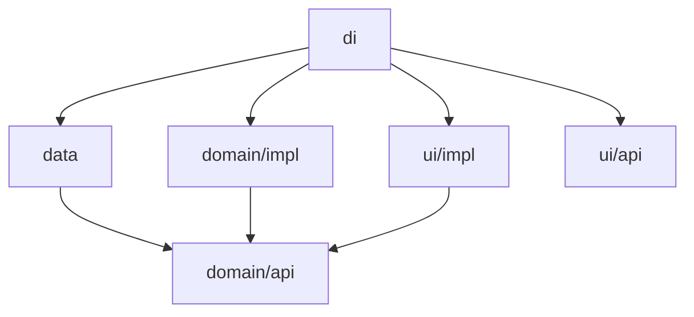

# Template Feature

The six-module template every new feature is generated from. It has two jobs:

1. **Source** — `./gradlew createLayer` copies these modules and renames them.
2. **Reference** — the single canonical example of the MVI split, Koin wiring, nav3
   route ownership and the polymorphic serialization contract.

It is included in `settings.gradle.kts`, so it compiles as part of `./gradlew build` —
if the contract breaks, the build breaks. That is the only reason the template cannot
rot silently.

## Module anatomy

| Module        | Gradle plugin                             | Contents                                                    | Depends on                      |
|---------------|-------------------------------------------|-------------------------------------------------------------|---------------------------------|
| `domain/api`  | `marketsJvmLibrary`                       | Models + `Repository`/`UseCase` interfaces                  | — (leaf)                        |
| `domain/impl` | `marketsJvmLibrary`                       | `UseCaseImpl`                                               | `domain/api`                    |
| `data`        | `marketsAndroidLibrary`                   | Ktor `RemoteApi`, DTOs, mapper, `RepositoryImpl`            | `domain/api`, `network/api`     |
| `ui/api`      | `marketsAndroidLibrary`                   | `Route` (`@Serializable`, `NavKey`)                         | `navigation/api`                |
| `ui/impl`     | `marketsAndroidFeatureUi`                 | `Screen`/`State`/`Event`/`ViewModel`/`Wrapper` + `section/` | `domain/api`, shared `ui/api`   |
| `di`          | `marketsAndroidFeatureUi` + `marketsKoin` | The Koin module — ties everything together                  | all of the above                |



Two rules hide in this graph:

- `domain/api` is pure JVM and looks at nothing — business rules never touch Android or
  Ktor.
- `ui/impl` does **not** depend on `ui/api`. The route and the screen are joined in `di`
  (`scope.entry<Route> { Wrapper() }`), so other features can navigate to the route
  without dragging in the screens.

## Generating a new feature

The task works **layer by layer**; it does not generate a whole feature in one command.

```bash
./gradlew createLayer --layer=domain:api  --feature=:markets-features:coins-list
./gradlew createLayer --layer=domain:impl --feature=:markets-features:coins-list
./gradlew createLayer --layer=data        --feature=:markets-features:coins-list
./gradlew createLayer --layer=ui:api      --feature=:markets-features:coins-list
./gradlew createLayer --layer=ui:impl     --feature=:markets-features:coins-list
./gradlew createLayer --layer=di          --feature=:markets-features:coins-list
```

Each command copies the source layer (excluding `build/`, `.gradle/`, `.git/`, `docs/`),
translates the tokens in file contents and file names, relocates package directories,
adds the `include(...)` to `settings.gradle.kts`, and appends the dependency line to the
feature's `di/build.gradle.kts`.

**Generate `di` last.** The template's `di/build.gradle.kts` already references every
layer with `api(...)`. If `di` is generated first, each later layer appends the same
dependency again as `implementation(...)` — the task does not treat the two lines as
duplicates, so you end up with double entries.

### Options

| Option           | Default                                    | Purpose                                                        |
|------------------|--------------------------------------------|----------------------------------------------------------------|
| `--layer`        | (required)                                 | `data`, `domain:api`, `domain:impl`, `ui:api`, `ui:impl`, `di` |
| `--feature`      | (required)                                 | Target location, e.g. `:markets-features:coins-list`           |
| `--source`       | `:template-feature`                        | Source feature to copy from                                    |
| `--source-layer` | same as `--layer`                          | Source layer                                                   |
| `--base-package` | `gradle.properties` → `projectBasePackage` | Package root                                                   |

With `--source` you can clone from a **real sibling feature** instead of the template.
When the template is too generic, a close sibling leaves less to fix afterwards:

```bash
./gradlew createLayer --layer=ui:impl --feature=:markets-features:coin-detail \
                      --source=:markets-features:coins-list
```

### Token translation

For `--feature=:markets-features:coins-list`:

| Source                                 | Target                                            | Where it appears                       |
|----------------------------------------|---------------------------------------------------|----------------------------------------|
| `TemplateFeature`                      | `CoinsList`                                       | Class/function names, file names       |
| `templateFeature`                      | `coinsList`                                       | Variables, `projects.` accessors       |
| `template_feature`                     | `coins_list`                                      | Package name, `namespace`              |
| `template-feature`                     | `coins-list`                                      | Gradle path segments                   |
| `com.devkurt.markets.template_feature` | `com.devkurt.markets.markets_features.coins_list` | Package root                           |

## Contracts the template carries

Know what it exemplifies before touching it:

- **The MVI split** — `Wrapper` only wires the ViewModel (`koinViewModel` +
  `collectAsStateWithLifecycle`). `Screen` is pure and takes only `state` + `onEvent`;
  layout lives in `Screen`, sub-pieces go to the `section/` package.
- **`LoadingCounter`** — the `combine(_state, loading.isLoading)` pattern. Loading state
  is merged into state inside the ViewModel; the screen never sees the counter.
- **Serializer registration** — the `polymorphic { subclass(...) }` block in `di`. If
  this registration is forgotten there is no compile-time warning; the app crashes with
  a `SerializationException` on the first navigation to the route, which the first
  manual run or Maestro flow surfaces immediately.
- **A single Koin module** — all of the feature's definitions (`RemoteApi`,
  `Repository`, `UseCase`, `ViewModel`, route entry, serializer) live in one
  `@Module @Configuration` class. Thanks to `@Configuration` the module is picked up
  without being added to `MarketsKoinApp` by hand.

## What to fill in after generating

1. `RemoteApi` → replace `ENDPOINT = "xx"` with the real endpoint, its schema first
   verified in [api-collections](../api-collections/README.md).
2. The `Response` DTO → the real response shape.
3. The domain model + its `toXxx()` mapper.
4. The `Route`'s parent graph — the template uses `GraphMain`. Use `GraphBottom` for a
   bottom tab, `GraphDashboard` inside the dashboard, and update the
   `polymorphic(...)` parent in `di` to match.
5. `State` fields + the `"TemplateFeature"` placeholder title in the `TopBar`.

## Known gaps

> **Location segment in the package name.** `--feature=:markets-features:coins-list`
> produces the package `com.devkurt.markets.markets_features.coins_list`, while the
> hand-written modules follow `com.devkurt.markets.graph_dashboard` (no location
> segment). A location-less invocation (`--feature=:coins-list`) fixes the package but
> generates the module at the repo root instead of under `markets-features/`. One of the
> two is currently corrected by hand.

> **Template freshness.** Compiling proves the contract is *intact*, not that it is
> *current*. CI builds the template with everything else, but nothing detects the moment
> a shared component changes in a way the template should mirror — that still relies on
> discipline.

> **This file is not copied.** `createLayer` copies layer directories (such as
> `template-feature/ui/impl`), not the feature root. Since this README sits at the
> feature root, it never leaks into generated features.
